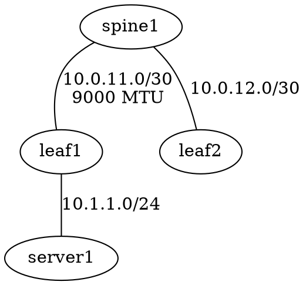

# Plan 051: Phase 3 — Advanced Features

**Priority:** Medium
**Effort:** 3-5 days
**Target:** `crates/nlink-lab/`, `bins/lab/`

## Summary

Add runtime modification, diagnostics, packet capture, topology visualization,
and process management. These features turn nlink-lab from a deploy-and-destroy
tool into an interactive network testing platform.

## Features

### 1. Runtime Impairment CLI Command

**Effort:** 0.5 day

The backend (`RunningLab::set_impairment()`) already exists. Add a CLI command.

**CLI:**
```
nlink-lab impair <lab> <endpoint> [--delay <ms>] [--jitter <ms>] [--loss <pct>] [--rate <rate>]
nlink-lab impair <lab> <endpoint> --clear
```

**Implementation:**

Add `Impair` variant to the `Commands` enum in `main.rs`:

```rust
Impair {
    lab: String,
    endpoint: String,
    #[arg(long)]
    delay: Option<String>,
    #[arg(long)]
    jitter: Option<String>,
    #[arg(long)]
    loss: Option<String>,
    #[arg(long)]
    rate: Option<String>,
    #[arg(long)]
    clear: bool,
}
```

Handler builds an `Impairment` from the flags and calls `lab.set_impairment()`.
If `--clear`, remove the qdisc via `conn.del_qdisc(iface, "root")`.

**File:** `bins/lab/src/main.rs`

#### Progress

- [ ] Add `Impair` command to CLI
- [ ] Build `Impairment` from CLI flags
- [ ] Handle `--clear` (remove qdisc)
- [ ] Print confirmation with new impairment values

### 2. Diagnostics

**Effort:** 1-2 days

Use nlink's built-in `Diagnostics` module to check lab health.

**CLI:**
```
nlink-lab diagnose <lab> [node]
```

**Output:**
```
[OK]   spine1:eth1 → leaf1:eth1   (10ms delay, 0 drops)
[OK]   leaf1:eth3  → server1:eth0 (0 drops)
[WARN] leaf2:eth3  → server2:eth0 (50ms delay, 0.4% loss, rate limited 100mbit)
```

**Implementation:**

For each namespace, create a `Diagnostics` instance and run `scan()`:

```rust
use nlink::netlink::diagnostics::{Diagnostics, DiagnosticsConfig};

impl RunningLab {
    pub async fn diagnose(&self, node: Option<&str>) -> Result<Vec<NodeDiagnostic>> {
        let mut results = Vec::new();
        for (node_name, ns_name) in &self.namespace_names {
            if let Some(filter) = node {
                if node_name != filter { continue; }
            }
            let conn: Connection<Route> = namespace::connection_for(ns_name)?;
            let diag = Diagnostics::new(conn);
            let report = diag.scan().await?;
            results.push(NodeDiagnostic { node: node_name.clone(), report });
        }
        Ok(results)
    }
}
```

**Files:** `crates/nlink-lab/src/running.rs`, `bins/lab/src/main.rs`

#### Progress

- [ ] Add `diagnose()` method to `RunningLab`
- [ ] Define `NodeDiagnostic` struct
- [ ] Add `Diagnose` command to CLI
- [ ] Format diagnostic output (OK/WARN per interface)

### 3. Packet Capture

**Effort:** 0.5 day

Spawn `tcpdump` in a namespace, writing to a pcap file.

**CLI:**
```
nlink-lab capture <lab> <endpoint> [-w <file>] [-c <count>]
```

**Implementation:**

```rust
Commands::Capture { lab, endpoint, output, count } => {
    let running = RunningLab::load(&lab)?;
    let ep = EndpointRef::parse(&endpoint)?;
    let mut args = vec!["-i", &ep.iface, "-nn"];
    if let Some(file) = &output {
        args.extend(["-w", file.to_str().unwrap()]);
    }
    if let Some(n) = count {
        args.extend(["-c", &n.to_string()]);
    }
    // Exec tcpdump in the namespace (foreground, streams to stdout)
    let output = running.exec(&ep.node, "tcpdump", &args)?;
    print!("{}", output.stdout);
}
```

The tricky part is making this interactive (Ctrl+C to stop). Options:
- **Simple:** `exec` with `-c <count>`, runs to completion
- **Interactive:** `spawn` + forward signals. More complex, defer if needed.

**File:** `bins/lab/src/main.rs`

#### Progress

- [ ] Add `Capture` command to CLI
- [ ] Spawn tcpdump in namespace
- [ ] Support `-w` (pcap file) and `-c` (packet count)

### 4. Topology Graph

**Effort:** 1 day

Print a topology as DOT (Graphviz) or simple ASCII.

**CLI:**
```
nlink-lab graph <topology.toml> [--format dot|ascii]
```

**DOT output:**


**ASCII output:**
```
spine1 ──── leaf1 ──── server1
  │           │
spine2 ──── leaf2 ──── server2
```

**Implementation:**

DOT is straightforward — iterate nodes and links, emit edges. ASCII is harder
(requires layout). Start with DOT only.

```rust
pub fn topology_to_dot(topology: &Topology) -> String {
    let mut out = format!("graph {:?} {{\n", topology.lab.name);
    for link in &topology.links {
        let a = EndpointRef::parse(&link.endpoints[0]).unwrap();
        let b = EndpointRef::parse(&link.endpoints[1]).unwrap();
        let label = link.addresses.as_ref()
            .map(|a| format!("{} ↔ {}", a[0], a[1]))
            .unwrap_or_default();
        out += &format!("  {} -- {} [label={:?}]\n", a.node, b.node, label);
    }
    out += "}\n";
    out
}
```

**Files:** `crates/nlink-lab/src/graph.rs` (new), `bins/lab/src/main.rs`

#### Progress

- [ ] Add `graph.rs` module with `topology_to_dot()`
- [ ] Add `Graph` command to CLI
- [ ] DOT format output
- [ ] (Optional) ASCII format with simple layout

### 5. Process Manager

**Effort:** 1 day

Track, monitor, and restart background processes.

**CLI:**
```
nlink-lab ps <lab>                    List processes
nlink-lab kill <lab> <node> <pid>     Kill a process
```

**Implementation:**

`RunningLab` already tracks PIDs in `pids: Vec<(String, u32)>`. Add:

```rust
impl RunningLab {
    /// Check which tracked processes are still running.
    pub fn process_status(&self) -> Vec<ProcessInfo> {
        self.pids.iter().map(|(node, pid)| {
            let alive = unsafe { libc::kill(*pid as i32, 0) } == 0;
            ProcessInfo { node: node.clone(), pid: *pid, alive }
        }).collect()
    }
}
```

**Files:** `crates/nlink-lab/src/running.rs`, `bins/lab/src/main.rs`

#### Progress

- [ ] Add `process_status()` to `RunningLab`
- [ ] Add `Ps` command to CLI (list processes with status)
- [ ] Add `Kill` command to CLI (kill specific process)
